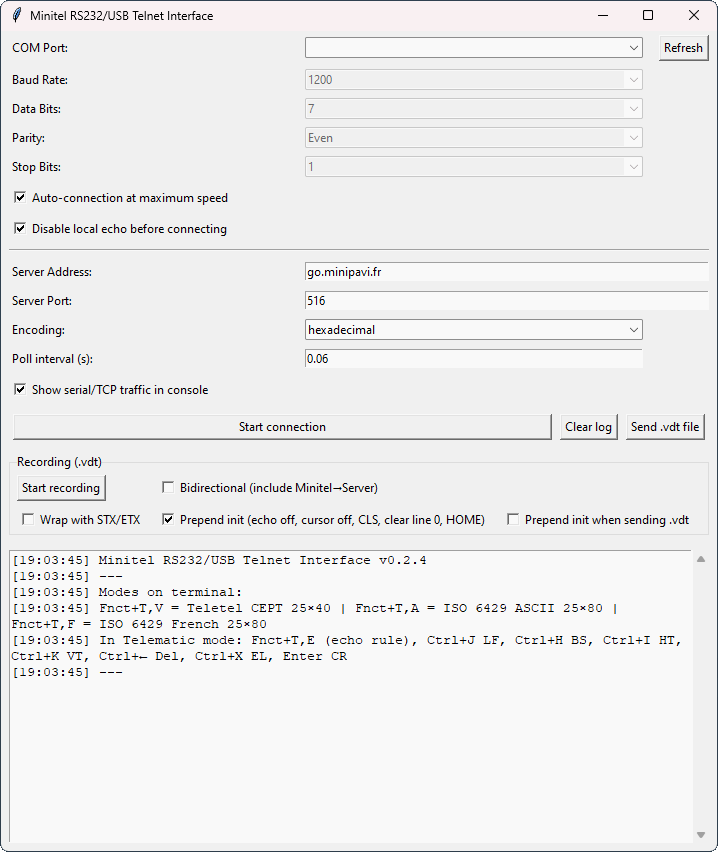

# Minitel RS232/USB Telnet Interface



**Minitel RS232/USB Telnet Interface** lets you bridge a Minitel terminal (via RS232/USB) to Telnet servers and BBSes. It handles bidirectional data, provides a clean Tkinter GUI, and includes tools to capture/play **.vdt** Videotex streams.

## Features

* **Auto-connect at maximum speed**
  Detects model via `ESC 9 {` and sets terminal speed with `ESC : k`. When enabled, manual serial fields are disabled (framing stays manual).
* **Disable local echo (pre-connect)** — optional, enabled by default.
* **.vdt recording** (between Start/Stop)
  Options: **Prepend init** (default ON), **STX/ETX** wrapping, **bidirectional** capture toggle.
* **Send .vdt file** to the Minitel
  Auto-strips STX/ETX, optional **prepend init**, can auto-open the serial port if not connected.
* **Unified init sequence** (used for export and optional sending): disable echo, hide cursor, clear screen, **clear line 0**, select **G1**, **HOME (0,0)**.
* **GUI niceties**
  Refresh COM ports, Clear log, show/hide traffic, encoding selector (hex / ISO-8859-1 / CP850 / CP437 / ISO-8859-15), adjustable poll interval.
  Non-blocking UI; Twisted reactor runs in background.

## Requirements

* **Python 3.8+** (missing libraries auto-installed on first run)
* Dependencies: **pyserial**, **twisted**

## Usage

1. Connect your Minitel via a RS232/USB adapter.
2. Run:

   ```bash
   python "Minitel RS232-USB Telnet Interface.pyw"
   ```
3. Leave **Auto-connection at maximum speed** ON to probe and set terminal speed (manual serial fields are greyed).
   If you need specific framing (7E1 / 8N1), uncheck auto-connection and set it manually.
4. Enter the Telnet **server address** and **port**, click **Start connection**.
5. (Optional) **Record .vdt**: click *Start recording*, then *Stop & Save .vdt*. Keep **Prepend init** ON for best playback compatibility; enable **STX/ETX** if your player expects it; toggle **Bidirectional** to also capture Minitel→server traffic.
6. (Optional) **Send .vdt file**: click *Send .vdt file*, choose a file; the app will strip STX/ETX if present and can **prepend init** before sending.

## Troubleshooting

* If connecting at **9600 bps**, many units require **8N1** — adjust manually (auto-connect won’t change framing).
* If a `.vdt` doesn’t replay well, export/record **with init** (default ON) so the terminal state is reset first.
* Make sure the correct COM port is selected and not used by another app.

---

# Interface Telnet RS232/USB Minitel


**Interface Telnet RS232/USB Minitel** relie un Minitel (via RS232/USB) à des serveurs Telnet/BBS. L’application gère la communication bidirectionnelle, propose une GUI Tkinter et des outils pour **capturer/envoyer des flux .vdt**.

## Fonctionnalités

* **Auto-connexion à la vitesse maximale**
  Détection par `ESC 9 {` et réglage de la vitesse via `ESC : k`. Quand activée, les champs série manuels sont grisés (le format 7E1/8N1 reste manuel).
* **Désactivation de l’écho local (avant connexion)** — optionnelle, activée par défaut.
* **Enregistrement .vdt** (entre Démarrer/Arrêter)
  Options : **Préfixer l’init** (activé par défaut), encapsulage **STX/ETX**, capture **bidirectionnelle**.
* **Envoi de fichier .vdt** au Minitel
  Détection/suppression auto de STX/ETX, **préfixe init** optionnel, ouverture auto du port série au besoin.
* **Séquence d’initialisation unifiée** : désactive l’écho, masque le curseur, efface l’écran, **efface la ligne 0**, sélection **G1**, **HOME (0,0)**.
* **Confort d’utilisation**
  Rafraîchissement des ports, nettoyage du log, affichage/masquage du trafic, choix d’encodage (hex / ISO-8859-1 / CP850 / CP437 / ISO-8859-15), intervalle de sondage ajustable.
  UI non bloquante ; Twisted en arrière-plan.

## Prérequis

* **Python 3.8+** (installation auto des dépendances au premier lancement)
* Dépendances : **pyserial**, **twisted**

## Utilisation

1. Reliez le Minitel avec un adaptateur RS232/USB.
2. Lancez :

   ```bash
   python "Minitel RS232-USB Telnet Interface.pyw"
   ```
3. Laissez **Auto-connection at maximum speed** activé pour détecter/régler la vitesse (les champs série sont grisés).
   Si vous devez forcer un format (7E1 / 8N1), décochez l’auto-connexion et réglez-le manuellement.
4. Saisissez **l’adresse** et **le port** du serveur Telnet, puis cliquez **Start connection**.
5. (Optionnel) **Enregistrer en .vdt** : cliquez *Start recording*, puis *Stop & Save .vdt*. Conservez **Préfixer l’init** activé pour une meilleure compatibilité ; cochez **STX/ETX** si votre lecteur l’exige ; activez **Bidirectional** pour capturer aussi le trafic Minitel→serveur.
6. (Optionnel) **Envoyer un .vdt** : cliquez *Send .vdt file*, choisissez le fichier ; l’appli retirera STX/ETX si présent et peut **préfixer l’init** avant envoi.

## Dépannage

* À **9600 bps**, beaucoup d’appareils exigent **8N1** — ajustez-le manuellement (l’auto-connexion ne change pas le framing).
* Si un `.vdt` se relit mal, exportez/enregistrez **avec init** (activé par défaut) pour remettre le terminal dans un état connu.
* Vérifiez le bon port COM et qu’aucune autre application ne l’occupe.
